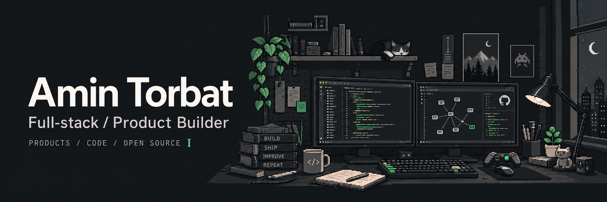

I build web products and the backend systems behind them.

## Selected work

### [PEYAR](work/peyar.md) · Customer management

A CRM for small businesses, bringing customers, sales stages, activity history, and follow-ups into one workspace.

`TypeScript` · `Next.js` · `PostgreSQL` · `Prisma`  
Active development · Private source

### [Guardora](work/guardora.md) · Community tools

Telegram moderation and group management, with persistent settings and permission-aware controls.

`Python` · `PostgreSQL` · `Telegram Bot API`  
Active beta · Private source

**Public projects** ↗ [Auto File Organizer](https://github.com/amintorbat/auto_file_organizer) · [IoT Edge Sentinel](https://github.com/amintorbat/iot_edge_sentinel)

## Open source & engineering

Contributing to open-source software and learning through collaboration.

Currently deepening my work in backend APIs, SQL, authorization, testing, and debugging.
